```{r setup, echo = F}
knitr::opts_chunk$set(
  comment = "#",
  collapse = TRUE,
  #cache = TRUE,
  warning = FALSE,
  message = FALSE,
  fig.width=6, fig.height=6,
  fig.align = 'center'
)
```

---
class: inverse, center, middle

# Comment tester les effets du changement climatique sur la distribution des espèces et la composition des communautés forestières ?

---
## Approches

- Observation ?

--
- Experimentation ?

--
- Modélisation ?

---
class: inverse, center, middle

# Modélisation

---
## Modélisation

- Phénoménologique
  - simple correlation
- Mécanistique
  - Basé sur le processus (série de règles)
  - Normalement soutenu par les théories

---
## Modèles phénoménologiques

.center[**Quelle est la corrélation entre le climat et la distribution des espèces ?**]

---
## Modèles phénoménologiques

.center[**Quelle est la corrélation entre le climat et la distribution des espèces ?**]

<br>
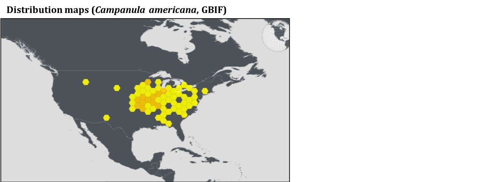

---
## Modèles phénoménologiques

.center[**Quelle est la corrélation entre le climat et la distribution des espèces ?**]

<br>
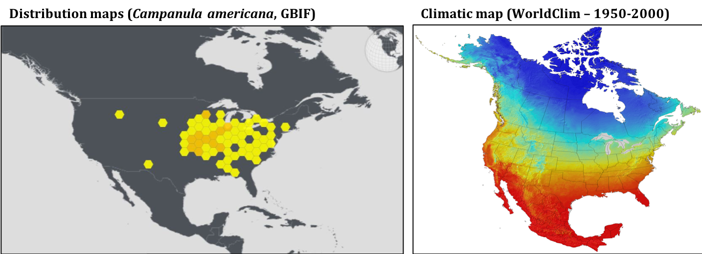

---
## Modèles phénoménologiques

.center[**Quelle est la corrélation entre le climat et la distribution des espèces ?**]

<br>
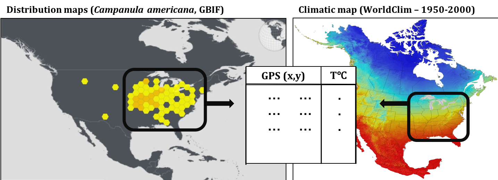

---
## Modèles phénoménologiques

.center[**Quelle est la corrélation entre le climat et la distribution des espèces ?**]

```{r, echo=FALSE, fig.height=4}
cg <- '#00796B'
x <- seq(-3, 3, length = 100)
dat <- data.frame(x, dnorm(x))
par(xaxs="i", yaxs="i", mar = c(2.2, 2.2, 2, 0.5))
plot(dat, type = "l", col = cg, axes = FALSE, lwd = 2.2, ylim = c(0.004, 0.41), xlim = c(-3, 5), xlab = "", ylab = "", xaxt = "n", yaxt = "n")
axis(1, at = c(-8, 8), lwd = 1.9)
axis(2, at = c(-8, 8), lwd = 1.9)
mtext("Temperature", 1, cex = 1, line = 0.8)
mtext("Probabilité d'occurance", 2, cex = 1, line = 0.8)
```

--

.center[lien établi -> prédiction !]

---
## Modèles phénoménologiques

.center[**Quelle est la corrélation entre le climat et la distribution des espèces ?**]

```{r, echo=FALSE, fig.height=4}
par(xaxs="i", yaxs="i", mar = c(2.2, 2.2, 2, 0.5))
plot(dat, type = "l", col = cg, axes = FALSE, lwd = 2.2, ylim = c(0.004, 0.41), xlim = c(-3, 5), xlab = "", ylab = "", xaxt = "n", yaxt = "n")
lines(dat$x + 2.2, dat$dnorm.x., col = "orange", lwd = 2.2)
axis(1, at = c(-8, 8), lwd = 1.9)
axis(2, at = c(-8, 8), lwd = 1.9)
mtext("Temperature", 1, cex = 1, line = 0.8)
mtext("Probabilité d'occurance", 2, cex = 1, line = 0.8)
mtext(expression(symbol("\256")), side = 3, line = -1, cex = 2.5)
mtext("Changements climatiques", side = 3, line = 0.75, cex = 0.8)
```

---
## Modèles phénoménologiques

Distribution de l'érable à sucre dans 100 ans

.center[

]
--
.center[*Croyez-vous qu'elle peut le faire ?*]

---
<br>
Quelles sont vos prédictions sur ce qu'il faut arriver pour que la forêt temperée émigre vers la forêt boréale ?
<br>
.center[
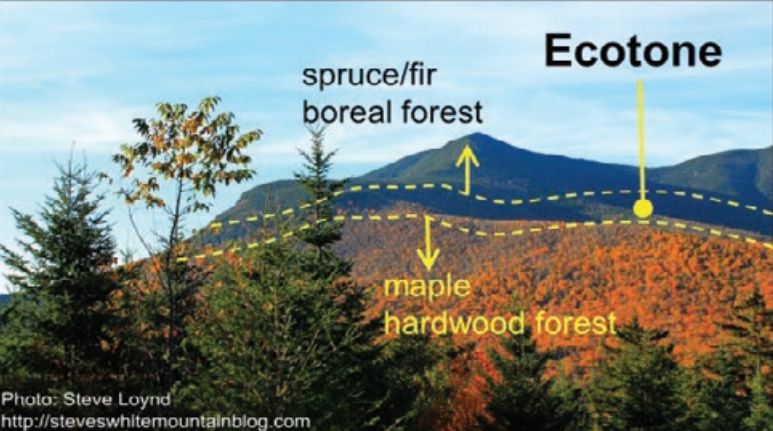
]

---
class: inverse, center, middle

# Un modèle plus mécanistique

---
## Les états

- **Boréale**
  - *Picea mariana, Picea glauca, Picea rubens, Larix laricina, Pinus banksiana, Abies balsamea, and Thuja occidentalis*
- **Tempérée**
  - *Prunus serotina, Acer rubrum, Acer saccharum, Fraxinus americana, Fraxinus nigra, Fagus gran- difolia, Ostrya virginiana, Tilia americana*
- **Mixte de boréale et tempérée** (écotone)
  - si les deux catégories d'espèces sont présent
- **Régeneration**
  - Surface terrier < 5 m²/ha

---
## Le modèle

.pull-left[
4 processus écologiques
]
.pull-right[
.center[
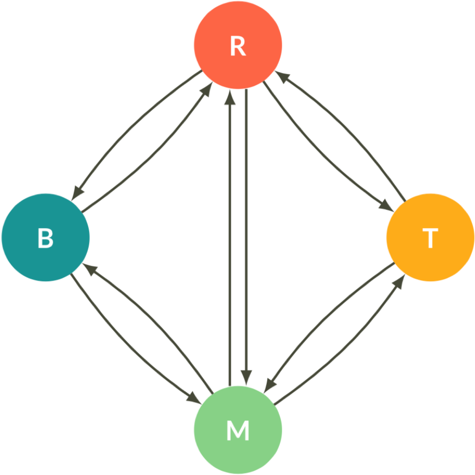
]]


---
## Le modèle

.pull-left[
4 processus écologiques
- Pertubation
]
.pull-right[
.center[
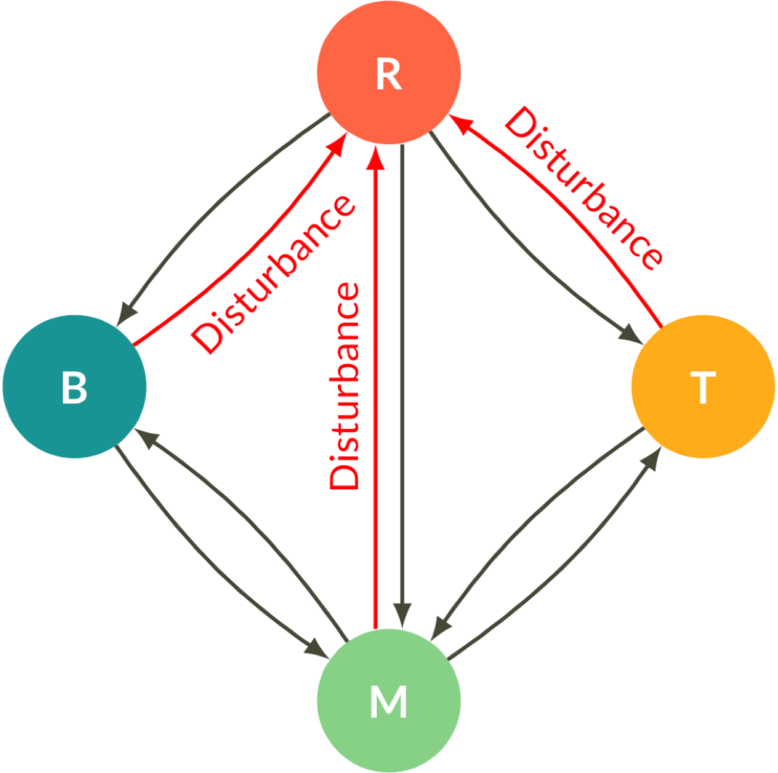
]]

---
## Le modèle

.pull-left[
4 processus écologiques
- Pertubation
- Succession
]
.pull-right[
.center[
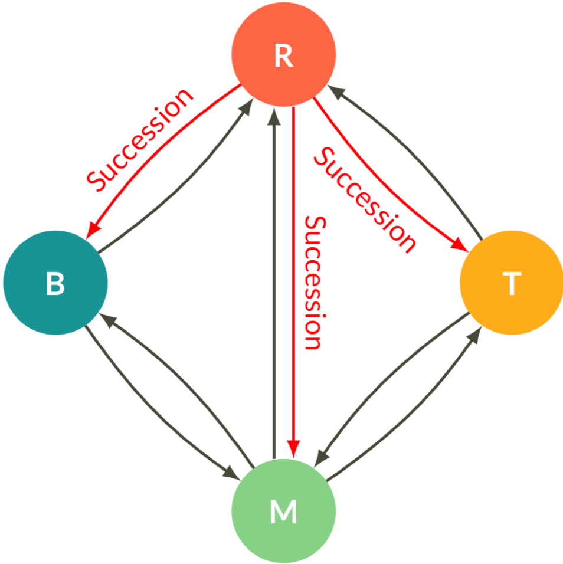
]]

---
## Le modèle

.pull-left[
4 processus écologiques
- Pertubation
- Succession
- Colonisation

]
.pull-right[
.center[
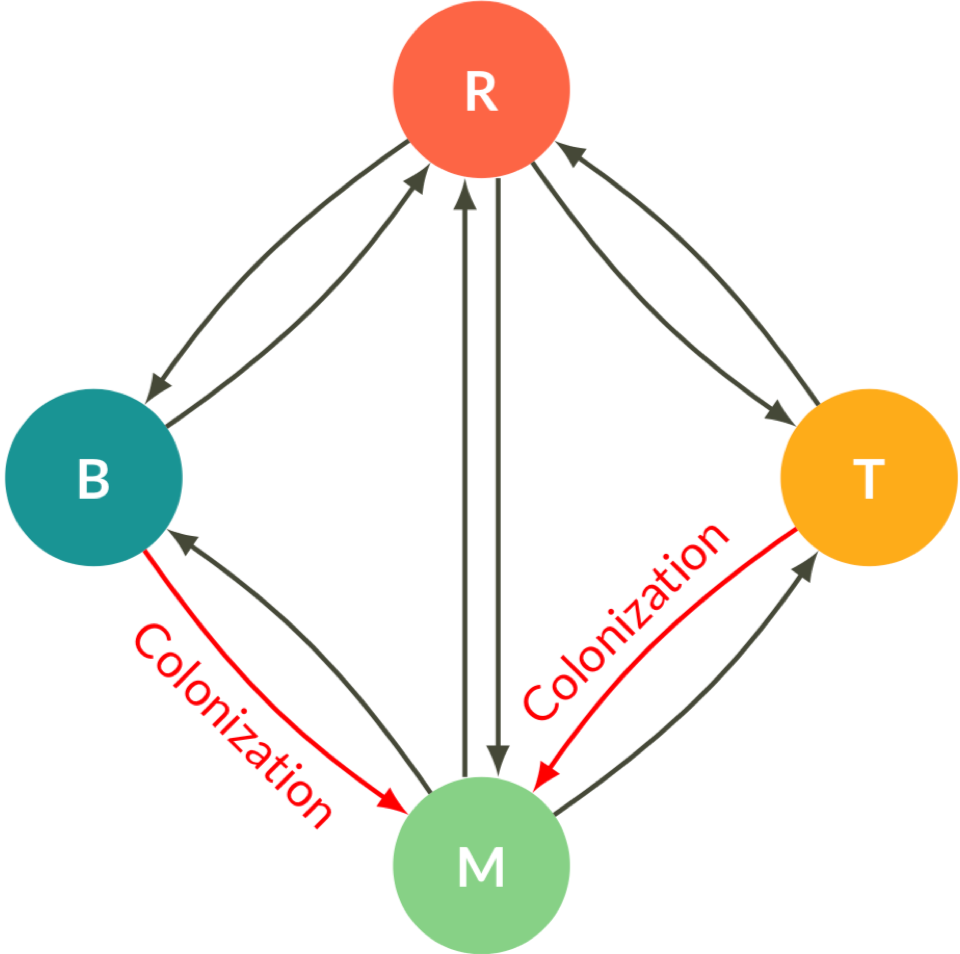
]]

---
## Le modèle

.pull-left[
4 processus écologiques
- Pertubation
- Succession
- Colonisation
- Exclusion competitive
]
.pull-right[
.center[
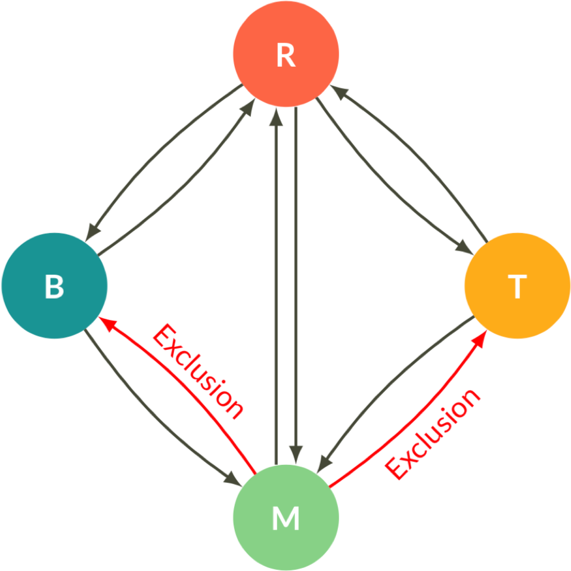
]]

---
## Le modèle

.pull-left[
4 processus écologiques
- Pertubation
- Succession
- Colonisation
- Exclusion competitive
- Migration
]
.pull-right[
.center[

]]

---
## Le modèle

.pull-left[
4 processus écologiques
- Pertubation
- Succession
- Colonisation
- Exclusion competitive
- Migration

<br>

Des processus dépendant de la
- Temperature
- Precipitation
- Abundance des états
]
.pull-right[
.center[

]]

---
## Le modèle - une simulation

<br>
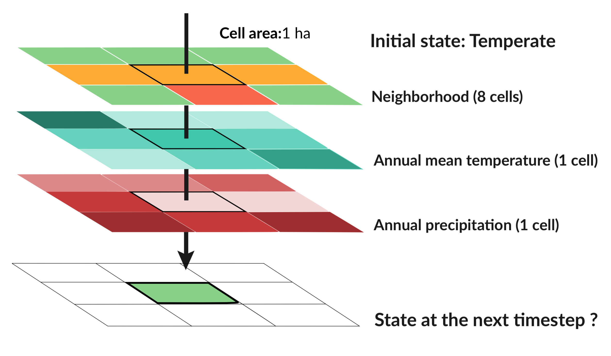

---
## Le modèle - résultat climat actuelle

*Représente-t-il bien la relation entre le climat et la distribution des espèces ?*

.center[

]

---
## Le modèle - simulation avec changement climatique

C'est quoi l'effet de l'augumentation de la temperature sur la distribution des états ?


---
## Résultats

.center[
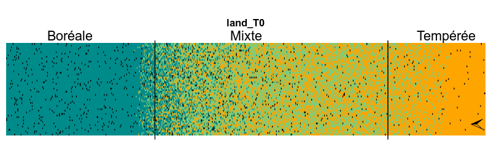
]

--
- *Quelles sont les conséquences de ce délai ?*

--
- *Et qu'est-ce qu'on peut faire dans ce cas ?*

---
class: inverse, center, middle

# L'aménagement forestier peut-il augmenter le taux de migration vers le nord ?

---
## Plan de géstion

.center[
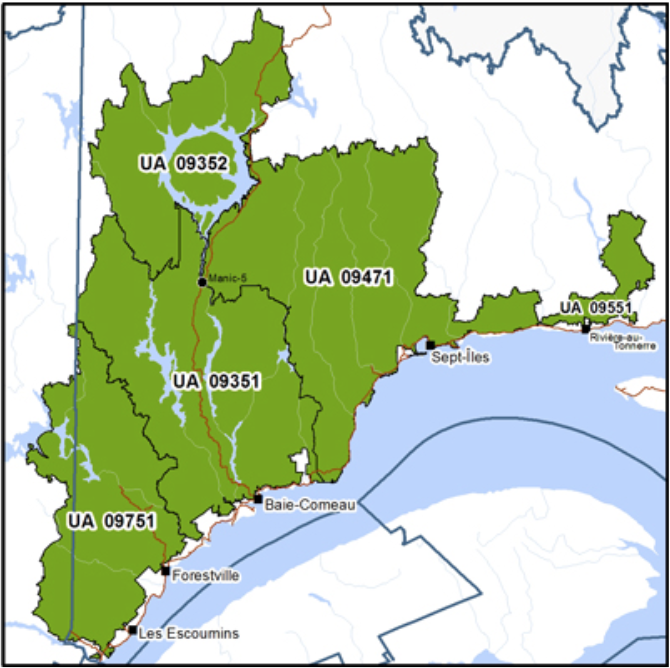
]

---
## Pratiques d'aménagement forestier

Coupe rase

.center[
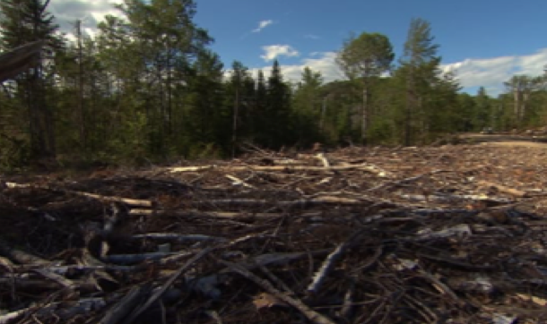
]

---
## Pratiques d'aménagement forestier

Plantation

.center[
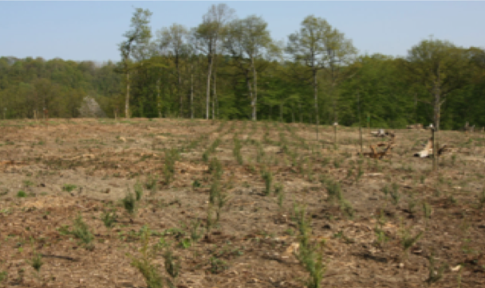
]

---
## Pratiques d'aménagement forestier

Éclaircie

.center[
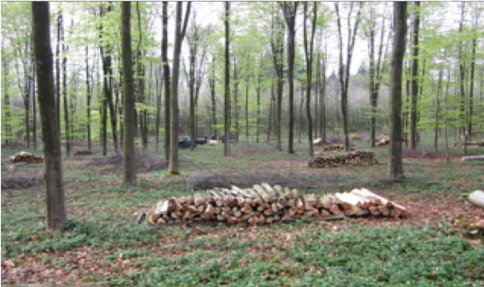
]

---
## Pratiques d'aménagement forestier

plantation d'enrichissement

.center[

]
--

.center[*Comment intégrer ces pratiques au modèle théorique des états ?*]

---
## Éclaircie ou pertubation naturelle ?

<br>
.center[
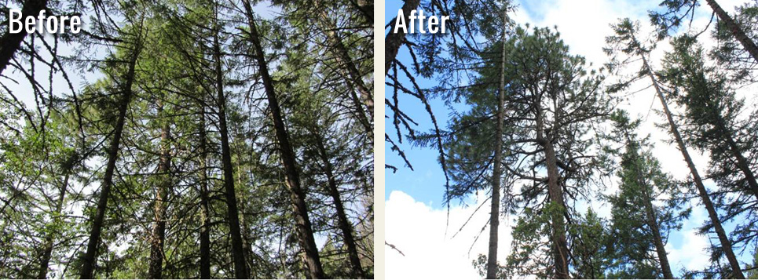
]

---
## Modèle + amenagement foresiter

Relier les processus du modèle avec les pratiques d'aménagement forestier

.center[

]

.center[

]

---
## Le modèle - simulation avec changement climatique

**Sans** aménagement forestier


**Avec** aménagement forestier


---
## Résultats - plantation

**Sans** aménagement forestier


**Avec** aménagement forestier


---
## Résultats - coupe rase

**Sans** aménagement forestier


**Avec** aménagement forestier
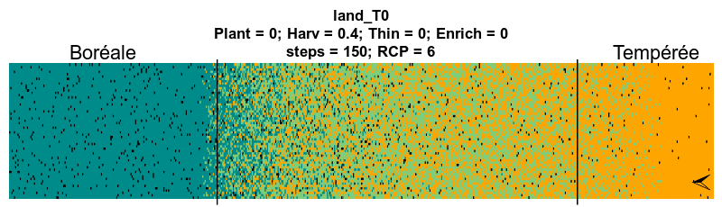

---
## Résultats - éclaircie

**Sans** aménagement forestier


**Avec** aménagement forestier
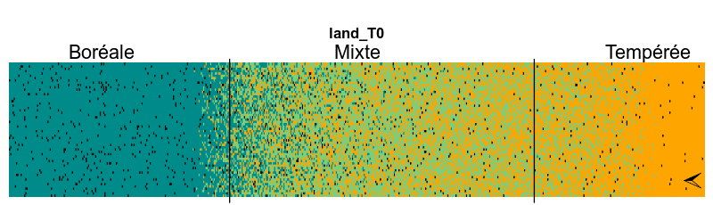

---
## Résultats - plantation d'enrichissement

**Sans** aménagement forestier


**Avec** aménagement forestier


---
class: inverse, center, middle

# Discussion
